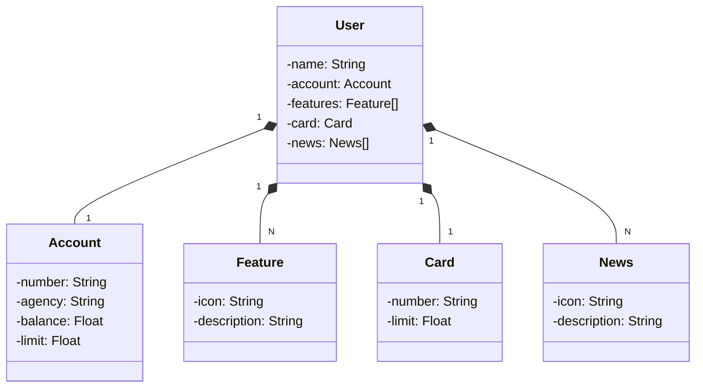

# Santander BootCamp 2023
Java RESTful API criada para a Santander BootCamp 2023.

## Diagrama de Classes

## Essa API REST foi a minha primeira a subir na nuvem (Railway). Um grande momento.
<h3> Você pode visualizar e testar <a href="https://api-bank-santander-production.up.railway.app/swagger-ui.html"> aqui. </a>

 Para informações e alguns detalhes, leia o arquivo "Documentação.txt". 

<h2> Até mais! ;) </h2>
